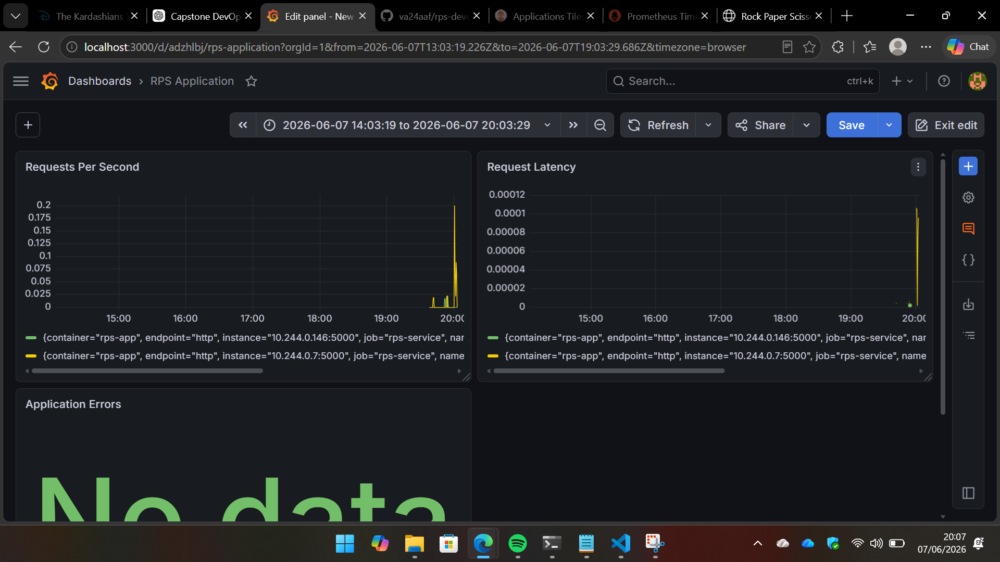
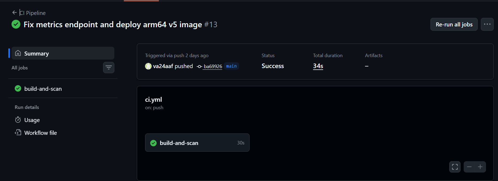
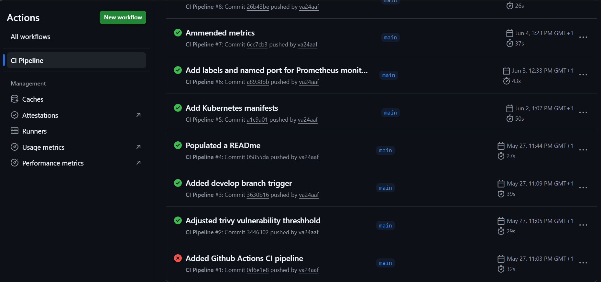
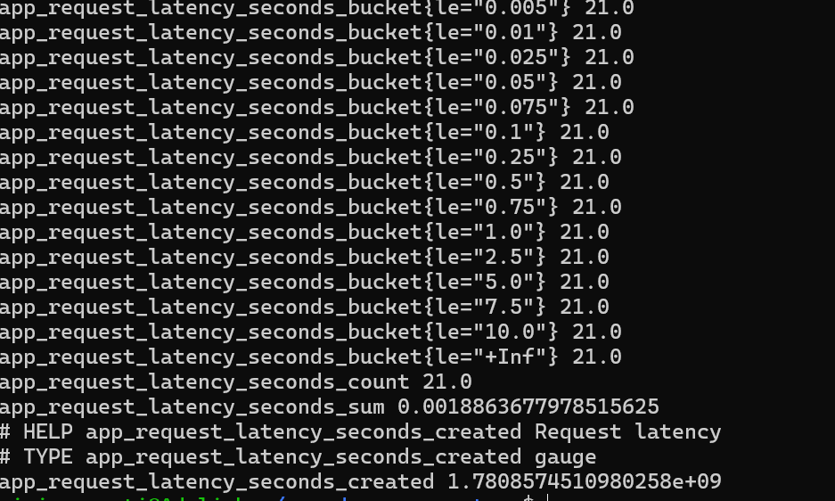
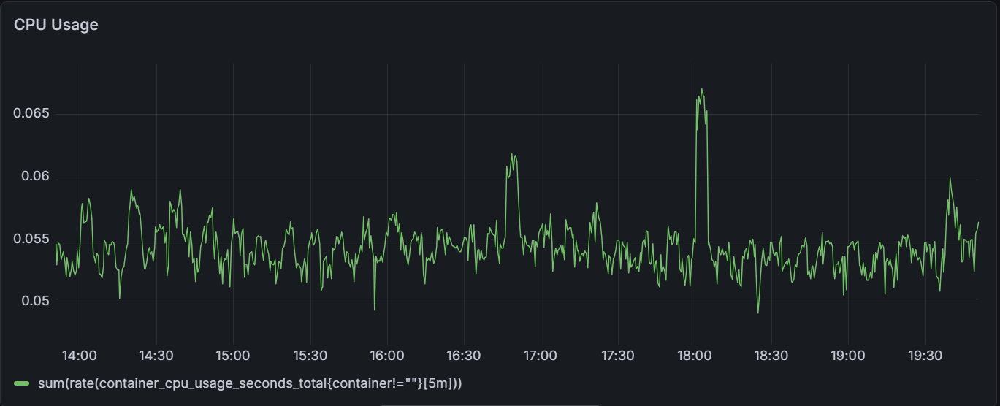
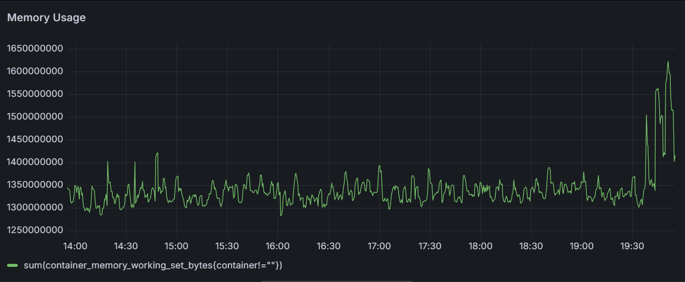
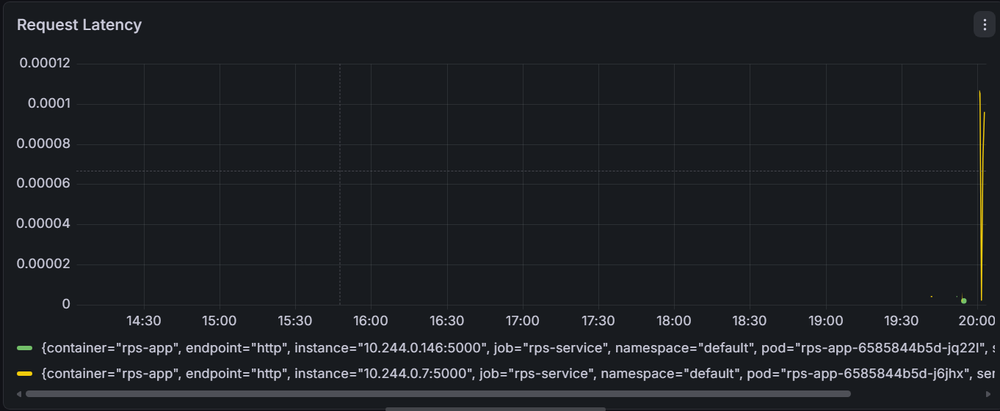
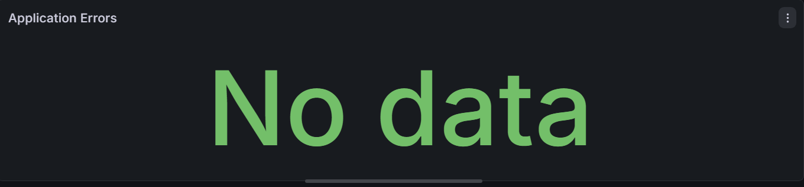

# RPS DevOps Capstone Project

## Overview

This project demonstrates the implementation of a complete cloud-native DevOps pipeline using a Flask-based Rock-Paper-Scissors web application.

The application was developed, containerized, secured, deployed, monitored, and managed using modern DevOps practices and tools including:

* Flask
* Docker
* GitHub Actions
* Trivy
* Azure Container Registry (ACR)
* Azure Kubernetes Service (AKS)
* ArgoCD
* Prometheus
* Grafana

The objective of this project was not only to build the application itself, but also to demonstrate Continuous Integration (CI), Continuous Delivery (CD), GitOps, Kubernetes orchestration, security scanning, monitoring, and troubleshooting in a real-world deployment environment.

---

# Architecture

Developer
↓
GitHub Repository
↓
GitHub Actions CI Pipeline
↓
Docker Image Build
↓
Trivy Security Scan
↓
Azure Container Registry (ACR)
↓
ArgoCD GitOps Deployment
↓
Azure Kubernetes Service (AKS)
↓
Prometheus Monitoring
↓
Grafana Dashboards

---

# Technologies Used

| Category                | Technology               |
| ----------------------- | ------------------------ |
| Backend                 | Flask                    |
| Version Control         | Git & GitHub             |
| CI/CD                   | GitHub Actions           |
| Containerization        | Docker                   |
| Security Scanning       | Trivy                    |
| Container Registry      | Azure Container Registry |
| Container Orchestration | Kubernetes (AKS)         |
| GitOps                  | ArgoCD                   |
| Monitoring              | Prometheus               |
| Visualization           | Grafana                  |

---

# Project Structure
```
rps-devops-capstone/
│
├── app.py
├── requirements.txt
├── Dockerfile
├── k8s
|   └── deployment.yaml
|       service.yaml
├── monitoring/
│   └── rps-servicemonitor.yaml
├── templates/
│   └── index.html
├── static/
│   └── style.css
├── .github/
│   └── workflows/
│       └── ci.yml
├── README.md
└── .gitignore
└── .dockerignore
```

---

# Day 1 – Flask Application Development

## Objectives

* Build a Rock-Paper-Scissors application
* Create a user interface
* Add monitoring endpoints
* Initialize Git repository

## Features Implemented

### Gameplay

Users can select:

* Rock
* Paper
* Scissors

The backend randomly generates a computer choice and determines the winner.

### Health Endpoint

```
GET /health
```

Response:

```
{
  "status": "healthy"
}
```

Used by Kubernetes readiness and liveness probes.

### Metrics Endpoint

```
GET /metrics
```

Implemented using:

```
pip install prometheus_client
```

Metrics exposed:

* Request count
* Request latency

### Local Testing

```
python app.py
```

Application:

```
http://localhost:5000
```

Deliverable:

✅ Application running locally

---

# Day 2 – Docker Containerization

## Objectives

* Containerize the Flask application
* Create Docker image
* Test container locally

## Dockerfile

```
FROM python:3.11-slim

WORKDIR /app

COPY requirements.txt .

RUN pip install --no-cache-dir -r requirements.txt

COPY . .

EXPOSE 5000

CMD ["python","app.py"]
```

## Build Image

```
docker build -t rps-app:v1 .
```

## Run Container

```
docker run -p 5000:5000 rps-app:v1
```

## Verification

Verified:

* Application endpoint
* /health endpoint
* /metrics endpoint

Deliverable:

✅ Application running inside Docker

---

# Day 3 – GitHub Actions CI Pipeline

## Objectives

* Automate builds
* Perform security scanning
* Push images automatically

## Workflow Location

```
.github/workflows/ci.yml
```

## Pipeline Stages

### Checkout Source Code

```
- uses: actions/checkout@v4
```

### Build Docker Image

```
docker build -t rps-app .
```

### Trivy Security Scan

Trivy scans for:

* OS vulnerabilities
* Package vulnerabilities

Build fails on:

* CRITICAL vulnerabilities

### Push to Azure Container Registry

Images are pushed automatically after successful validation.

## Image Tagging Strategy

```
rps-app:${{ github.sha }}
```

Benefits:

* Immutable deployments
* Traceability
* Rollback support

Deliverable:

✅ CI Pipeline operational

---

# Day 4 – Azure Infrastructure

## Objectives

* Provision Azure resources
* Configure Kubernetes environment

## Create Resource Group

```
az group create \
--name rps-devops-rg \
--location uksouth
```

## Create Azure Container Registry

```
az acr create \
--resource-group rps-devops-rg \
--name rpsdevopsacr12345 \
--sku Basic
```

## Create AKS Cluster

```
az aks create \
--resource-group rps-devops-rg \
--name rps-aks \
--node-count 1 \
--generate-ssh-keys
```

## Connect kubectl

```
az aks get-credentials \
--resource-group rps-devops-rg \
--name rps-aks
```

## Verify Cluster

```
kubectl get nodes
```

Deliverable:

✅ AKS cluster operational

---

# Day 5 – Kubernetes Deployment

## Objectives

* Deploy application to AKS
* Expose service externally

## Deployment

```
kubectl apply -f deployment.yaml
```

Features:

* 2 replicas
* Rolling updates
* Health probes

## Service

```
type: LoadBalancer
```

Apply:

```
kubectl apply -f service.yaml
```

Verification:

```
kubectl get pods

kubectl get svc

kubectl get endpoints rps-service
```

Deliverable:

✅ Application accessible via public IP

---

# Day 6 – GitOps with ArgoCD

## Objectives

* Implement Continuous Delivery
* Enable GitOps workflow

## Install ArgoCD

```
kubectl create namespace argocd

kubectl apply \
-n argocd \
-f https://raw.githubusercontent.com/argoproj/argo-cd/stable/manifests/install.yaml
```

## Access ArgoCD

```
kubectl port-forward svc/argocd-server \
-n argocd 8080:443
```

## Retrieve Admin Password

```
kubectl get secret argocd-initial-admin-secret \
-n argocd \
-o jsonpath="{.data.password}" | base64 -d
```

## Configuration

Configured:

* Git Repository
* Application
* Auto Sync
* Self Heal
* Prune

Deliverable:

✅ Git Push → Automatic Deployment

---

# Day 7 – Monitoring Stack

## Objectives

* Monitor Kubernetes cluster
* Monitor application metrics

## Install Prometheus & Grafana

```
helm repo add prometheus-community https://prometheus-community.github.io/helm-charts

helm repo update

helm install monitoring prometheus-community/kube-prometheus-stack \
-n monitoring \
--create-namespace
```

## Verification

```
kubectl get pods -n monitoring

kubectl get prometheus -n monitoring

kubectl get servicemonitor -A
```

## ServiceMonitor

Created custom ServiceMonitor for application metrics collection.

Metrics scraped:

* Request count
* Request latency
* Application health

Deliverable:

✅ Monitoring stack operational

---

# Day 8 – Troubleshooting and Optimization

## Issue 1 – Prometheus Target Down

### Error

```
received unsupported Content-Type "text/html; charset=utf-8"
```

### Root Cause

Metrics endpoint returned incorrect content type.

### Resolution

Updated metrics endpoint to use:

```
from prometheus_client import CONTENT_TYPE_LATEST

return Response(
    generate_latest(),
    mimetype=CONTENT_TYPE_LATEST
)
```

---

## Issue 2 – ServiceMonitor Not Discovered

### Root Cause

Prometheus was configured with:

```
serviceMonitorSelector:
  matchLabels:
    release: monitoring
```

ServiceMonitor was missing the required label.

### Resolution

Added:

```
labels:
  release: monitoring
```

Target successfully discovered.

---

## Issue 3 – ImagePullBackOff

### Error

```
ImagePullBackOff
401 Unauthorized
```

### Investigation

Checked cluster architecture:

```
kubectl get node \
-o jsonpath='{.status.nodeInfo.architecture}'
```

Output:

```
arm64
```

### Root Cause

Container image architecture mismatch.

### Resolution

Built ARM64-compatible image and redeployed.

Application deployed successfully.

---

# Grafana Dashboards

Created dashboards for:

## Kubernetes Dashboard

* CPU Usage
* Memory Usage
* Pod Restarts

## Application Dashboard

* Requests per Second
* Request Latency
* Application Health

## ArgoCD Dashboard

* Application Health Status
* Sync Status

Deliverable:

✅ Full observability implemented

---

# Screenshots

## 1. Application Dashboard



---

## 2. GitHub Actions CI Pipeline



---

## 3. GitHub Actions Workflow History



---

## 4. ArgoCD Application Synced and Healthy


---

## 5. Prometheus Monitoring Targets


---

## 6. Metrics Endpoint Verification



---

## 7. Grafana Home Page


---

## 8. Grafana Data Sources


---

## 9. Kubernetes Dashboard - CPU Usage



---

## 10. Kubernetes Dashboard - Memory Usage



---

## 11. Kubernetes Dashboard - Pod Restarts


---

## 12. Application Dashboard - Latency



---

## 13. Application Dashboard - Errors



---

# Lessons Learned

This project provided hands-on experience with:

* Containerization using Docker
* CI/CD automation with GitHub Actions
* Vulnerability scanning using Trivy
* Azure cloud infrastructure
* Kubernetes deployments
* GitOps workflows using ArgoCD
* Monitoring using Prometheus
* Dashboard creation using Grafana
* Production troubleshooting and debugging

Key troubleshooting activities included:

* Prometheus scraping failures
* ServiceMonitor discovery issues
* Metrics endpoint configuration problems
* ARM64 container image compatibility issues
* Kubernetes ImagePullBackOff diagnostics

---

# Author

**Vivian Amati**

DevOps Capstone Project
